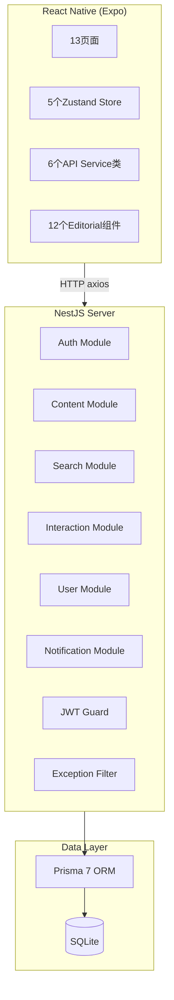

# 旅记 TravelLog — 旅游内容展示平台

> **设计风格：** Editorial 编辑杂志风 | **方法论：** SDD → DDD → DD → E2E
> **AI 协作：** Claude Code + DeepSeek V4 Pro | **工期：** 2026/06/09 — 06/11

---

## 一、项目简介

**旅记 TravelLog** 是一款以编辑杂志风格呈现的旅游内容发现与分享平台。基于 React Native (Expo) 跨平台前端 + NestJS 后端 + SQLite 数据库，覆盖6个业务领域、31个 API 端点、13个前端页面。

### 核心功能

- 内容发现：首页推荐、Banner轮播、分类浏览、内容详情、图片全屏
- 搜索筛选：关键词搜索、多维筛选（分类/地区/价格/评分）、排序
- 互动系统：评论与回复、点赞、收藏、通知
- 用户系统：注册登录、JWT鉴权、个人资料、发布内容、收藏管理、浏览历史

---

## 二、技术栈

| 层 | 技术 | 选型理由 |
|---|---|---|
| **前端框架** | React Native (Expo SDK 56) | 跨平台 iOS+Android 一套代码，生态成熟 |
| **UI 设计** | Editorial 自定义设计系统 | 硬边缘无圆角、单色#1C1C1C、暖米色#F9F8F6背景 |
| **字体** | Noto Serif SC + Noto Sans SC | 衬线标题+无衬线正文，编辑杂志风 |
| **状态管理** | Zustand | 轻量级(<1KB)，5个领域Store独立管理 |
| **导航** | React Navigation (Bottom Tabs + Stack) | 5个Tab导航+跨栈路由 |
| **HTTP** | axios + Token拦截器 + 401自动刷新队列 | 统一鉴权、Token刷新防竞态 |
| **后端框架** | NestJS 11 | 装饰器模式天然支持DDD分层架构 |
| **ORM** | Prisma 7 + libsql适配器 | 类型安全、声明式Schema |
| **数据库** | SQLite (零外部依赖) | 单文件部署、无需安装MySQL/Redis |
| **鉴权** | JWT (AccessToken 15min + RefreshToken 7d) | 双Token轮转，bcrypt密码哈希 |
| **测试** | Jest + Supertest (后端集成测试) | 47个测试覆盖全部31个API |

---

## 三、项目结构

```
travellog-delivery/
├── README.md                       # 本文档
├── docs/
│   ├── 01-PRD.md                   # 产品需求文档
│   ├── 02-ER图.md                  # 数据库ER图 (Mermaid)
│   ├── 03-架构设计.md               # DDD架构设计 (Mermaid流程图)
│   ├── 04-API文档.md               # 35个API契约文档
│   ├── 05-设计文档.md               # v1 MVP设计文档
│   ├── 06-Prompt记录.md            # AI协作Prompt记录(≥6段)
│   ├── 07-开发工作流反思.md          # 开发流程与AI协作反思
│   ├── 10-schema.sql               # MySQL版DDL
│   ├── 11-seed.sql                 # MySQL版种子数据
│   └── 12-e2e-tests.ts             # E2E测试代码

travellog-server/                   # NestJS后端项目
├── prisma/
│   ├── schema.prisma               # Prisma Schema (11表)
│   ├── seed.ts                     # SQLite种子脚本 (327条)
│   └── migrations/                 # 数据库迁移
├── src/
│   ├── main.ts                     # 入口 — ValidationPipe, CORS
│   ├── app.module.ts               # 7模块全局注册
│   ├── common/                     # 基础设施层
│   │   ├── prisma/                 # PrismaService (全局)
│   │   ├── guards/                 # JwtAuthGuard + @Public()
│   │   ├── decorators/             # @CurrentUser()
│   │   ├── interceptors/           # TransformInterceptor → {code,data,message}
│   │   └── filters/                # HttpExceptionFilter
│   └── modules/                    # 6个业务领域 + 通知
│       ├── auth/                   # 认证域 (5 API)
│       ├── content/                # 内容域 (9 API)
│       ├── search/                 # 搜索域 (2 API)
│       ├── interaction/            # 互动域 (7 API)
│       ├── user/                   # 用户域 (5 API)
│       └── notification/           # 通知域 (3 API)
├── test/
│   └── integration.e2e-spec.ts     # 47个集成测试
├── dev.db                          # SQLite数据库
└── package.json

travellog-app/                      # React Native前端项目
├── App.tsx                         # 入口 — 字体加载 + NavigationContainer
├── index.ts                        # registerRootComponent
├── src/
│   ├── shared/                     # 跨领域共享
│   │   ├── components/             # 12个Editorial UI组件
│   │   ├── styles/                 # Design Tokens + FORBIDDEN规则
│   │   ├── types/                  # 全局类型定义
│   │   └── utils/mockData.ts       # Mock数据 (7条高质量样例)
│   ├── infrastructure/             # 基础设施
│   │   ├── http/                   # axios + API Config + Mock/Real切换
│   │   └── storage/                # Token持久化
│   ├── navigation/                 # React Navigation路由系统
│   ├── domains/                    # 6个业务领域
│   │   ├── auth/                   # 认证域 (pages/services/store)
│   │   ├── content/                # 内容域 (5 pages)
│   │   ├── search/                 # 搜索域 (pages/services/store)
│   │   ├── map/                    # 地图域 (page)
│   │   ├── interaction/            # 互动域 (pages/services/store)
│   │   └── user/                   # 用户域 (7 pages)
│   └── app.json
└── package.json
```

---

## 四、运行指南

### 4.1 环境要求

- **Node.js** ≥ 18.x
- **npm** ≥ 9.x
- **Expo Go** App (iOS/Android 手机安装)

### 4.2 后端启动

```bash
cd ~/Desktop/travellog-server

# 1. 安装依赖
npm install

# 2. 初始化数据库 + 种子数据
npm run db:seed    # 执行 seed.ts → 创建11表 + 插入327条数据

# 3. 构建并启动 (http://localhost:3000)
npx nest build && node dist/src/main.js
```

#### 种子账号

种子数据包含 20 个用户，密码统一为 **`Abc123456`**：

| 用户ID | 用户名 | 手机号 (登录账号) |
|--------|--------|-------------------|
| u-01 | 旅行达人老张 | 13800000001 |
| u-02 | 背包客小明 | 13800000002 |
| u-03 | 摄影爱好者Lily | 13800000003 |
| u-04 | 美食探店小王 | 13800000004 |
| u-05 | 户外探险阿杰 | 13800000005 |
| u-06 | 文艺小清新七七 | 13800000006 |
| u-07 | 自驾游老司机 | 13800000007 |
| u-08 | 海岛控阿花 | 13800000008 |
| u-09 | 历史迷老刘 | 13800000009 |
| u-10 | 亲子游宝妈 | 13800000010 |

> 更多用户 (u-11 ~ u-20) 格式同理：手机号 `13800000011` ~ `13800000020`，密码均为 `Abc123456`。
> 用户数据源见 `prisma/seed.ts`。

### 4.3 前端启动

```bash
cd ~/Desktop/travellog-app

# 1. 安装依赖
npm install

# 2. 启动 Expo Metro 打包器
npx expo start --clear

# 3. 手机打开 Expo Go App → 扫码
# mock模式 (USE_MOCK=true) → 离线可运行，使用内置Mock数据
# 真实API (USE_MOCK=false) → 连接后端 http://localhost:3000
```

### 4.4 运行测试

```bash
cd ~/Desktop/travellog-server

# 启动服务器
npm run db:seed && node dist/src/main.js &

# 运行全部E2E测试
npm run test:e2e
# 输出: Test Suites: 1 passed, Tests: 47 passed, 47 total
```

---

## 五、数据库

### 表结构总览 (11张表)

| 领域 | 表名 | 用途 | 种子数据量 |
|------|------|------|-----------|
| 用户域 | `user` | 用户主表 | 20 |
| 用户域 | `user_auth` | 第三方登录关联 | — |
| 用户域 | `refresh_token` | JWT刷新Token | 2 |
| 用户域 | `verify_code` | 验证码(TTL 5min) | 2 |
| 内容域 | `travel_content` | 旅游内容主表 | 60 |
| 内容域 | `category` | 内容分类 | 5 |
| 内容域 | `banner` | 首页轮播 | 8 |
| 互动域 | `comment` | 评论(自引用树) | 100 |
| 互动域 | `favorite` | 收藏 | 40 |
| 互动域 | `like_record` | 点赞(统一多态) | 60 |
| 互动域 | `notification` | 通知 | 30 |

详见 `docs/02-ER图.md` (含 Mermaid ER图)。

---

## 六、API 接口

31个API端点按领域分组：

| 领域 | 接口数 | 鉴权 |
|------|--------|------|
| Auth | 5 | 公开 (注册/登录/验证码/刷新Token/重置密码) |
| Content | 9 | 读取公开、写入JWT (分类/Banner/推荐/详情/搜索/筛选/发布/编辑/相关) |
| Search | 2 | 公开 (热词/建议) |
| Interaction | 7 | 读取公开、写入JWT (评论CRUD/点赞/收藏) |
| User | 5 | JWT (资料/编辑/头像/收藏/我的发布) |
| Notification | 3 | JWT (列表/已读/未读数) |

**统一响应格式：** `{ "code": 0, "data": {...}, "message": "ok" }`

详见 `docs/04-API文档.md`。

---

## 七、高质量样例数据 (7条旅游内容)

| # | 标题 | 分类 | 地区 | 评分 | 价格 |
|---|------|------|------|------|------|
| 1 | 九寨沟 — 人间仙境的水之盛宴 | 自然风光 | 四川省 | 4.9 | ¥169 |
| 2 | 黄山 — 五岳归来不看山 | 自然风光 | 安徽省 | 4.8 | ¥190 |
| 3 | 张家界 — 阿凡达取景地 | 自然风光 | 湖南省 | 4.7 | ¥228 |
| 4 | 故宫 — 六百年皇城 | 历史古迹 | 北京 | 4.9 | ¥60 |
| 5 | 成都美食地图 | 美食探店 | 四川省 | 4.8 | ¥0 |
| 6 | 上海法租界漫步 | 城市漫步 | 上海 | 4.5 | ¥0 |
| 7 | 三亚 — 东方夏威夷 | 海岛度假 | 海南省 | 4.6 | ¥0 |

每条含：标题、简介、富文本详情、分类、地区、地址、经纬度、封面图URL、图片列表、评分、门票价格、开放时间、联系电话、标签、浏览量、点赞数、收藏数、评论数、作者信息。

详见 `src/shared/utils/mockData.ts` 和后端种子脚本 `prisma/seed.ts`。

---

## 八、测试覆盖

| 层级 | 测试数 | 覆盖范围 |
|------|--------|---------|
| 后端集成测试 | 47 | 31个API端点 + 16个边界/安全场景 |
| 通过率 | 100% | 47/47 passed |

测试覆盖5条核心用户旅程：
1. Journey 1: 用户注册与登录 (6 tests)
2. Journey 2: 内容发现与浏览 (8 tests)
3. Journey 3: 搜索与筛选 (5 tests)
4. Journey 4: 评论/点赞/收藏互动 (9 tests)
5. Journey 5: 个人中心与通知 (8 tests)
6. 边界与安全 (11 tests)

详见 `docs/12-e2e-tests.ts`。

---

## 九、Git Commit 层级规范

```
docs/       → 文档提交
schema/     → 数据库Schema + 种子数据
ui/         → UI组件 (Editorial Design System)
feat/       → 功能实现 (前端+后端)
fix/        → Bug修复
test/       → 测试代码
refactor/   → 重构
chore/      → 工程配置
```

### 后端提交历史 (travellog-server，共12 commits)

```
3aa5165 fix: remove expo dependency from NestJS server — was causing QR code confusion
c720d18 chore: remove .expo artifacts from server project
ede39ca fix: remove spurious extends expo/tsconfig.base from server tsconfig
06a7b6b fix: code review — BE critical & high issues resolved
bdb81b9 test: 47 integration tests covering 31 API endpoints across 5 journeys
9d6610d feat: Search, Interaction, User, Notification Domain APIs — 19 endpoints
b85b754 feat: Content Domain API — 7 endpoints (categories, banners, recommend, detail, related, create, update)
a67809e feat: Auth Domain API — 5 endpoints (send-code, register, login, reset-password, refresh-token)
c27a8de seed: SQLite seed script — 20 users, 60 contents, 100 comments + test data
b9bfc64 feat: NestJS backend infrastructure — SQLite + JWT + global layer
944cd1a schema: add seed data — 20 users, 5 categories, 8 banners, 60 contents, 100 comments, 40 favorites, 60 likes, 30 notifications
b0d91f4 chore: init NestJS project with Prisma 7 schema — 9 tables, 7 enums, full relations
```

### 前端提交历史 (travellog-app，共19 commits)

```
0d3707d feat: P1 iteration — search history, browse history, publish, favorites management
930a2c6 feat: P0 iteration — real auth, CategoryListScreen, rich content
8959679 feat: banner auto-scroll — advances every 3 seconds with smooth animation
8fdee89 fix: banner images — remove wrapper View, flat AppImage in bannerSlide
b536c2a fix: banner images not showing — remove flex center from imageWrap
e14c8f1 fix: banner — centered slides with consistent sizing and image containment
d635893 fix: keyword-matched images — each destination gets themed LoremFlickr photos
43009c6 fix: replace broken Unsplash URLs with working Picsum + LoremFlickr images
6f3fbef fix: replace broken external images with local PlaceholderImage, fix category search
b26f33c fix: render real images in Banner (was text-only placeholder), add BUILD_ID, AppInput scroll lock
7761c75 fix: 5 UI issues — real images, scroll lock, category nav, map scroll, safe area
1adf699 fix: Expo crash — Expo Router conflict, font loading timeout, app name
0fe8ce7 fix: code review — FE critical & high issues resolved
964351c feat: 5 new User domain pages — EditProfile, MyFavorites, MyContents, Settings, About
9af8d42 fix: frontend-backend type alignment for integration
2c97b01 feat: frontend data layer — axios HTTP client + 6 API services + 6 Zustand stores + page wiring
bd7c9c8 ddd: 8 page skeletons + ContentCard + navigation + mock data
fc42ec8 ddd: Editorial Design System + 12 shared UI components
3fd08a9 Initial commit
```

---

## 十、架构一览



---
